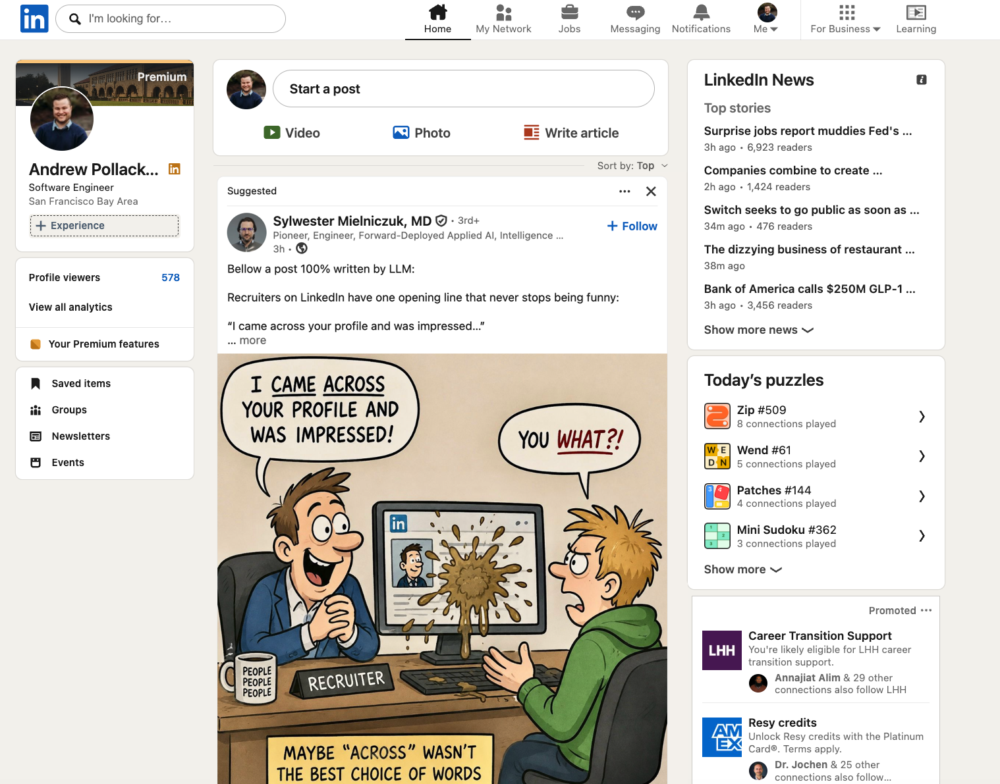
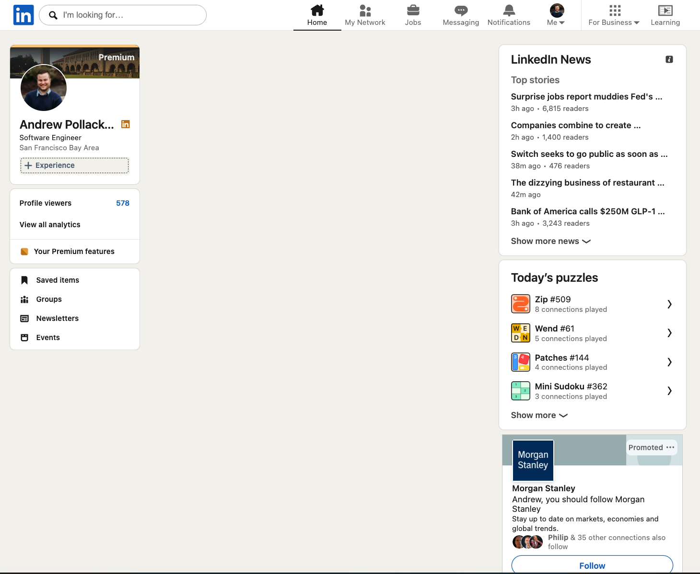

# LinkedIn Feed Blocker

A minimal Chrome extension that disables LinkedIn's home feed while keeping the rest of LinkedIn usable.

## What it does

* Hides the entire main feed on `/feed`
* Blocks infinite-scroll feed pagination
* Leaves profiles, jobs, search, messaging, notifications, and other LinkedIn features alone

## Why?

I like LinkedIn for finding jobs and chatting with recruiters. I do not like being greeted by the wild-west social feed.

After having "experienced" the Before image below, I decided to do something about it. Hence, this extension.

## Before / After

<table>
  <tr>
    <th>Before</th>
    <th>After</th>
  </tr>
  <tr>
    <td></td>
    <td></td>
  </tr>
</table>

## Install

1. Download or clone this repository somewhere permanent on your computer.

2. Open Chrome and go to:

   ```text
   chrome://extensions
   ```

3. Enable **Developer mode** in the top-right corner.

4. Click **Load unpacked**.

5. Select the `linkedin-feed-blocker` directory.

6. Reload LinkedIn.

The extension will remain enabled unless you disable or remove it from `chrome://extensions`.


## Developer Notes

### Updating

After changing `manifest.json`, `rules.json`, or `feed.css`:

1. Open `chrome://extensions`
2. Find **LinkedIn Feed Blocker**
3. Click **Reload**
4. Reload LinkedIn

### How it works

#### `feed.css`

Hides LinkedIn's main feed, including the post composer:

```css
[data-testid="mainFeed"] {
  display: none !important;
}
```

#### `rules.json`

Blocks requests for additional main-feed posts by targeting:

```text
sduiid=com.linkedin.sdui.pagers.feed.mainFeed
```

The rule intentionally targets LinkedIn's `mainFeed` pager instead of the generic pagination endpoint, which could interfere with other parts of LinkedIn.
